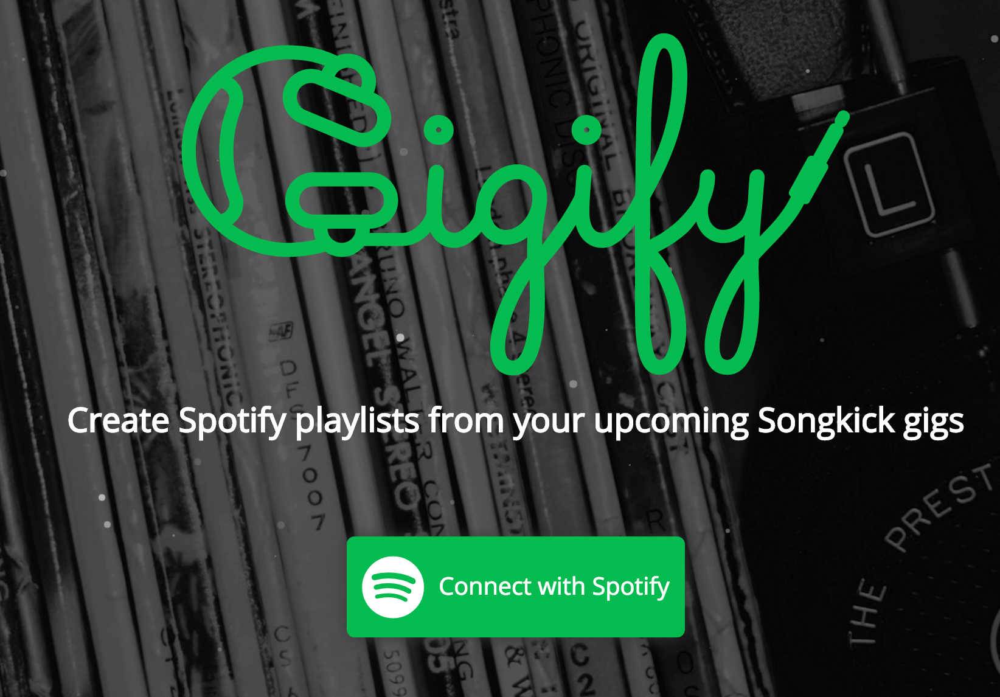
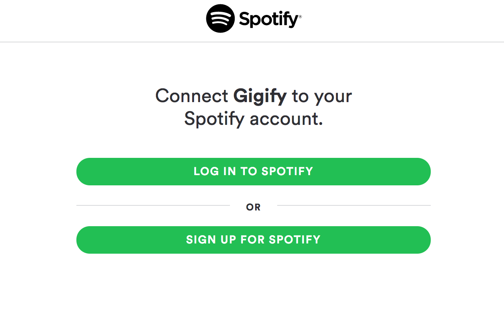
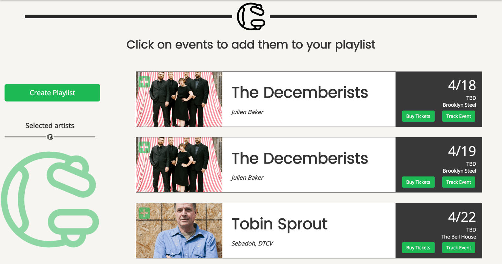

[]

[](http://commitizen.github.io/cz-cli/)[](https://github.com/gigify-music/gigify/issues)

Gigify is an artist discovery tool. It uses [Songkick](http://www.songkick.com) event data to display upcoming concerts that you might be interested in and allows you to make [Spotify](http://www.spotify.com) playlists to help you learn more about supporting artists and better plan your night out. You can also receive SMS reminders of upcoming gigs and purchase tickets.

## Getting Started

These instructions will get you a copy of the project up and running on your local machine for development and testing purposes. See deployment for notes on how to deploy the project on a live system.

### Prerequisites

Note, these steps are not required to run our deployed version of [Gigify](gigify.io).

1. Fork and clone the repo.

2. To install dependencies, navigate to the downloaded repo directory directory using the command line and run:
```npm install
```
3. Create a new application on the [Spotify Developer Site](https://developer.spotify.com/my-applications/) to obtain an API key.

4. Request a [Songkick API key](https://www.songkick.com/api_key_requests/new). Be prepared to wait at least a week and to be asked to justify your request before a key is granted. The [Songkick API Forum](https://groups.google.com/forum/#!forum/songkick-api) can be helpful if it takes too long. Songkick staff respond to questions in the forum.

5. Create a [Twilio](https://www.twilio.com/try-twilio) account and request an [API key](https://www.twilio.com/docs/api/rest/keys)

### Installing

Gigify requires a .env file to be created before running it. This file should be placed in the root of your directory and should look like this:
```
TWILIOSID=(replace with Twilio ID) // Provided by Twilio
TWILIOAUTHTOKEN=(replace with Twilio auth token) Provided by Twilio
APP_KEY= (replace with Spotify app key) // Provided by Spotify
APP_SECRET= (replace with Spotify app secret) // Provided by Spotify
SONGKICK_KEY=8CwyZanXp3Y52D1K (replace with Songkick API key) // Provided by Songkick
PGDATABASE=(replace with PostgreSQL database name)
PGUSER=(replace with PostgreSQL username)
PGPASSWORD=(replace with PostgreSQL password)
PGURL=(replace with url of PostgreSQL database or localhost)
PGPORT=5432 (This is the default PostgreSQL port, change if necessary)
```

## Use
# Login

1. 

2. 
Note: A Spotify account is required to use Gigify. Spotify credentials are never handled by Gigify and are transmitted securely to Spotify only.

# Search
Enter your Songkick Username if you have one.

1. 

Or select a genre search. These searches only are valid in New York City at this time.
2. 

# Select Gigs and make a playlist


## Built With

* [Express](https://expressjs.com/)- Flexible Node.js web application framework
* [Node.js](https://nodejs.org) - JavaScript runtime
* [Passport](http://passportjs.org/) - Simple authentication for Node.js
* [Particles.js](https://github.com/VincentGarreau/particles.js/) - Lightweight JavaScript library for creating particles
* [PostgreSQL](https://www.postgresql.org/) - Object-relational database
* [React](https://facebook.github.io/react/) - JavaScript library for building user interfaces
* [Redux](http://redux.js.org/) - Predictable state container for JavaScript apps
* [SASS](http://sass-lang.com/) - CSS extension language
* [Twilio](https://www.twilio.com/) - Messaging platform
* [Webpack](https://webpack.github.io/) - Module bundler

## Data Sources
* [Songkick API](https://www.songkick.com/developer) - Songkick gives you easy access to over 5 million upcoming and past concerts

* [Spotify API](https://developer.spotify.com/web-api/) - With Spotify, it’s easy to find the right music for every moment – on your phone, your computer, your tablet and more.

## Contributing

Please read [CONTRIBUTING.md] for details on our code of conduct, and the process for submitting pull requests to us.

## Authors

* **Jordan Estes** - [EstesJL](https://github.com/EstesJL)
* **JP Marra** - [jpmarra](https://github.com/jpmarra)
* **Scott Sanders** - [ScottDavidSanders](https://github.com/ScottDavidSanders)
* **Aamir Yousuf** - [iamongit](https://github.com/iamongit)

[Contributors](https://github.com/your/project/contributors) will be gratefully acknowledged.

## License

This project is licensed under the MIT License - see the [LICENSE.md](LICENSE.md) file for details
